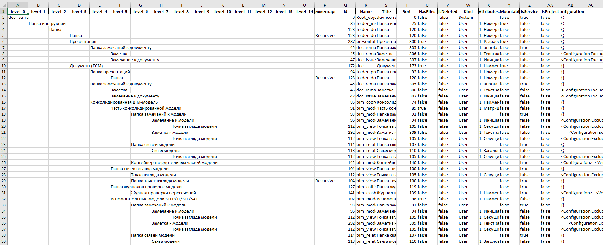

## Описание
Скрипты для обработки файла конфигурации Pilot-MyAdmin.

В **setting.json** необходимо задать значение **url**, указав актуальный путь к файлу конфигурации, а также **base_element** для указания корневого элемента.

## Скрипты

- **main.py** - позволяет получить дерево дочерних типов для указанного имени типа в формате *.xlsx с вложенной структурой и дополнительными полями типов (по умолчанию).

    **Пример:**

    

- **config_parse.py** - производит обработку *.xml файла кофигурации, сохраняет конфигурацию в формате JSON при запуске из модуля.

    Метод **parsing_xml** возвращает словарь, который используется в других модулях.

- **get_types_by_attribute.py** - выводит все типы, содержащие указанный атрибут (поиск по системному имени).

- **get_all_types.py** - выводит таблицу всех типов в файл *.xlsx.