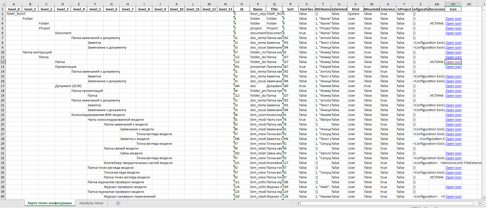
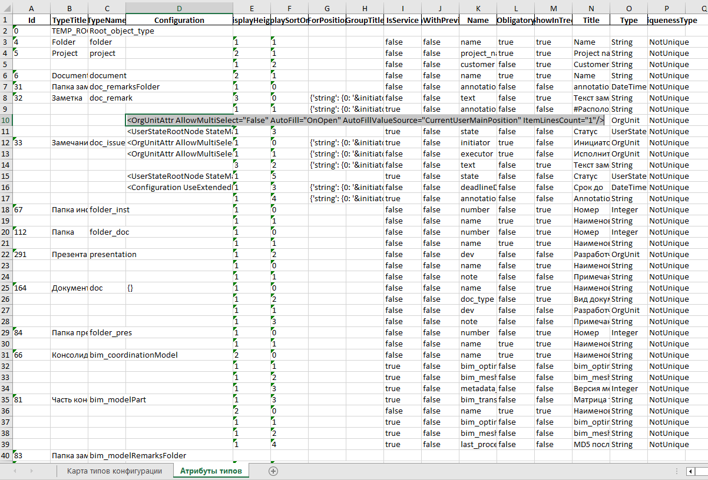

## Описание
Скрипты для обработки файла конфигурации Pilot-MyAdmin.

## Использование

Клонировать репозиторий средствами git или загрузить исходный код с GitHub (предполагает установленный гит: Git - Downloads и python: Download Python )

- cmd - открываем консоль

Команды в консоли

- `cd ../folder` - переходим в директорию, в которую будем копировать репозиторий

- `git clone https://github.com/stdmyst/pilot-parse-config` - клонируем репозиторий

- `cd pilot-parse-config`

Следующее также применимо при ручной загрузке репозитория:

- `python -m venv .venv` - создаём виртуальное окружение

- `cd .venv/Scripts`

- `activate` - активируем виртуальное окружение

- `cd ../..`

- `pip install -r requirements.txt` - установка необходимых пакетов в виртуальное окружение

После завершения установки на основе '.env_template' создать файл **'.env'**, указав путь до конфигурации и базовый элемент для поиска.

> Результат отработки пишется в папку files.

## Скрипты

- **main.py** - формирует xlsx файл со следующим содержимым:

    - Дерево дочерних типов относительно базового с дополнительными характеристиками;
    - Таблица атрибутов с характеристиками для каждого дочернего типа.

- **config_parse.py** - производит обработку *.xml файла конфигурации, сохраняет конфигурацию в формате JSON при загрузке из модуля

**Примеры:**

