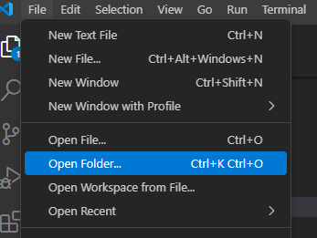
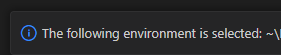
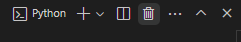

## Описание
Скрипты для обработки файла конфигурации Pilot-MyAdmin.

## Использование

Клонировать репозиторий средствами git или загрузить исходный код с GitHub (предполагает установленный гит: [Git - Downloads](https://git-scm.com/downloads) и python: [Download Python](https://www.python.org/downloads/))

Создать виртуальное окружение, которое будет использоваться для установки необходимых пакетов и запуска скриптов:

- `cmd` - открываем консоль

Команды в консоли:

- `cd ../folder` - переходим в директорию, в которую будем копировать репозиторий

- `git clone https://github.com/stdmyst/pilot-parse-config` - клонируем репозиторий;
    
    Вместо клонирования можно просто разархивировать архив, [загруженный с GitHub](https://github.com/stdmyst/pilot-parse-config/archive/refs/heads/master.zip)

- `cd pilot-parse-config` - переходим в директорию проекта

- `python -m venv .venv` - создаём виртуальное окружение

- `cd .venv/Scripts`

- `activate` - активируем виртуальное окружение

- `cd ../..`

- `pip install -r requirements.txt` - установка необходимых пакетов в виртуальное окружение

После завершения установки на основе '.env_template' создать файл **'.env'**, указав путь до конфигурации и базовый элемент для поиска.

> Результат отработки пишется в папку files.

Далее доступно два варианта работы с проектом:

- Через консоль:
    
    Использовать команду `python ../py/main.py` для запуска модуля (*убедиться, что активировано виртуальное окружение*)

**С помощью VS Code:**

- Открыть папку с проектом в VS Code:

    

- Задать виртуальное окружение для проекта: `ctrl+shift+p` -> 'Python: Create Environment' -> 'Venv' ->'Use Existing' - созданное ранее окружение будет применено по умолчанию для проекта:

    

Теперь можно запускать скрипты напрямую из VS Code, без дополнительных действий.

**Примечание:** если значения в файле **'.env'** были изменены, скрипт нужно запускать из нового терминала, иначе будут применены старые переменные среды.

Для этого достаточно просто закрыть терминал в VSCode и запустить скрипт:

## Скрипты

- **main.py** - формирует xlsx файл со следующим содержимым:

    - Дерево дочерних типов относительно базового с дополнительными характеристиками;
    - Таблица атрибутов с характеристиками для каждого дочернего типа.

- **config_parse.py** - производит обработку .xml файла конфигурации, сохраняет конфигурацию в формате JSON при загрузке из модуля

**Примеры:**

